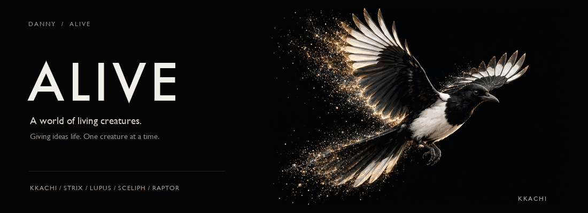

<!-- SYNC: Keep the hero, selected systems, and archive aligned with README.md. -->

<samp><a href="./README.md">한국어</a> · English</samp>

  

## ALIVE — where living things come together.

Starting with animals, I build products with the names and character of living things. Distinct identities come together under one brand, with room for new life to join.

  

**LIVE** [Pook ↗](https://www.pookparty.com/) · [Docs Compass ↗](https://www.docscompass.com/ko) · [Stock Compass ↗](https://stockcompass.vercel.app/) · [Yunseol ↗](https://yun-seol.com/)

---

SELECTED SYSTEMS / 01

### ALIVE

**A brand that brings living things together.**

Just as magpies, owls, wolves, beavers, and octopuses each have their own character, every ALIVE product has its own role and identity. The brand starts with animals and will grow to embrace a wider world of living things.

**ALIVE FAMILY** 
[KKACHI ↗](https://github.com/djfksjd/kkachi-releases) · STRIX · [LUPUS ↗](https://github.com/djfksjd/lupus) · [OCTO ↗](https://github.com/djfksjd/imagination-octo) · [SCELIPH ↗](https://github.com/djfksjd/sceliph) · [CASTOR ↗](https://github.com/djfksjd/castor) · [RAPTOR ↗](https://github.com/djfksjd/ROS_RAPTER) in research

**PLANNED ADDITIONS** 
CORVUS · CAMELUS · SALTIC · and more living things to come

Each new product idea adds another name to ALIVE. **One brand. Distinct lives. A growing family of products.**

<samp>A BRAND OF LIVING THINGS · DISTINCT IDENTITIES · AN EXPANDING FAMILY</samp>

---

SELECTED SYSTEMS / 02

### [ir-search](https://github.com/djfksjd/ir-search)

An agent skill that goes beyond finding grants: it compares each program with the project and **decides whether it is actionable now**. It surveys K-Startup, Bizinfo, NIPA, KOCCA, and SMTECH, then classifies the result as `apply now / meet conditions / reframe`.

<samp>OPEN SOURCE · PYTHON · MULTI-HOST · PROFILE-MATCHED RESEARCH</samp>

[Explore the system →](https://github.com/djfksjd/ir-search)

---

SELECTED SYSTEMS / 03

### [Imagination Octo](https://github.com/djfksjd/imagination-octo)

Instead of asking an AI to “be more creative,” it **structurally blocks the paths to obvious answers**. The engine diverges, the human chooses the direction, and brainstorming turns that choice into a pressure-tested concept.

<samp>50–0 BLIND EVAL (GPT-5.4, 2026-07) · HUMAN-IN-THE-LOOP · CLAUDE CODE + CODEX</samp>

[See the evaluation method and workflow →](https://github.com/djfksjd/imagination-octo#measured-2026-07-30)

---

## Git in motion

<picture>
  <source media="(prefers-color-scheme: dark)" srcset="https://raw.githubusercontent.com/djfksjd/djfksjd/output/github-contribution-grid-snake-dark.svg">
  <source media="(prefers-color-scheme: light)" srcset="https://raw.githubusercontent.com/djfksjd/djfksjd/output/github-contribution-grid-snake.svg">
  
</picture>

Redrawn daily from real GitHub contribution data.

  

<strong>More work</strong> — public agent archive

 

**Public agents**

- [castor](https://github.com/djfksjd/castor) — an engineering gate that checks code, firmware, HDL and hardware designs against evidence (formerly ironcode)
- [lupus](https://github.com/djfksjd/lupus) — a local supervisor that makes Claude Code and Codex finish verifiable work
- [session-alarm](https://github.com/djfksjd/session-alarm) — hooks that play an animal sound when your coding agent needs you
- [ai-agent-skills](https://github.com/djfksjd/ai-agent-skills) — HWPX document engine, multi-agent content team, and emotional TTS pipeline
- [sole-search](https://github.com/djfksjd/sole-search) — eligibility research for Korean small-business support programs
- [patent-search-skill](https://github.com/djfksjd/patent-search-skill) — prior-art research and differentiation guidance with KIPRIS and Google Patents
- [cover-letter-team](https://github.com/djfksjd/cover-letter-team) — a multi-agent cover-letter team that refuses to invent experience
- [stockagent](https://github.com/djfksjd/stockagent) — six-stage trading orchestration from research to orders and reporting

## Working set

Python · PyTorch · TypeScript · React · Flutter · Supabase AI agents · local-first products · creative tools · evaluation systems

## Say hello

Always happy to talk about ALIVE, new products, and practical agent systems. [eodnjs748@gmail.com](mailto:eodnjs748@gmail.com) · [GitHub repositories](https://github.com/djfksjd?tab=repositories)

ALIVE — a growing family of living things.

